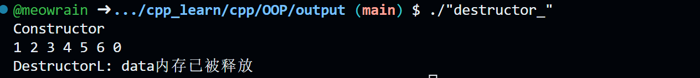
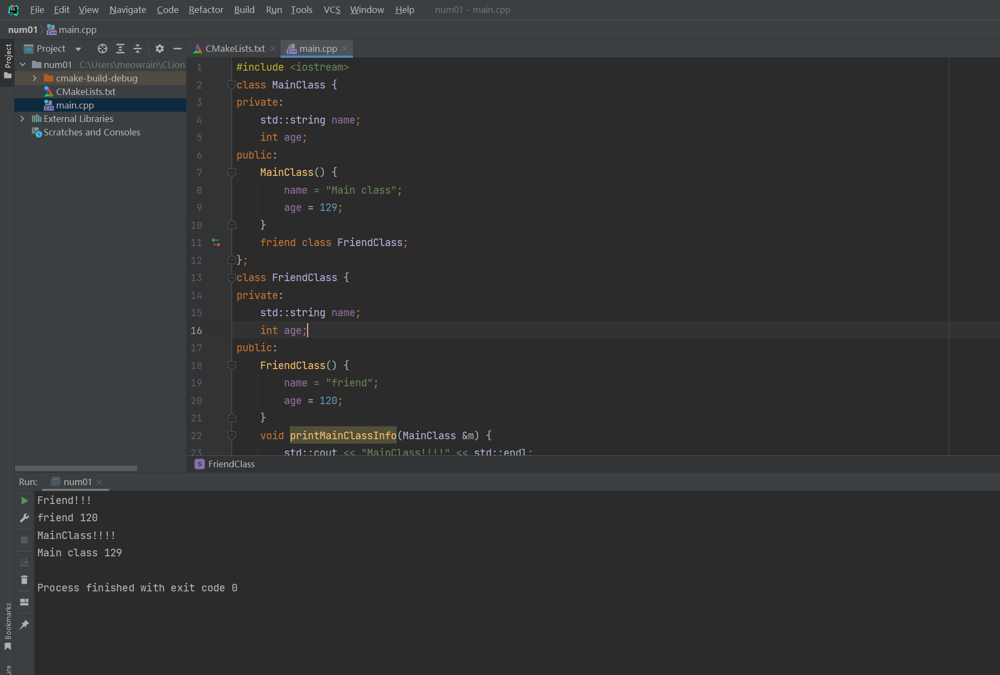

# C++ OOP

## Class(1)

### private,protected,public

#### private(默认就是 private)

private 声明的类的私有成员只能由同一类的其他成员或者它们的朋友访问

```cpp
#include <iostream>
#include <string>
class Student {
private:
    int score;
public:
    std::string name;
    int age;
    Student(std::string _name,int _age,int _score) : name(_name),age(_age),score(_score){

    }
    void getScore(){
        std::cout << score << std::endl;
    }
};
int main(void) {
    Student s("meow",18,100);
    s.getScore();
}
```


我们如果在 main 函数中直接用对象输出学生的分数，就不能

```cpp
#include <iostream>
#include <string>
class Student {
private:
    int score;
public:
    std::string name;
    int age;
    Student(std::string _name,int _age,int _score) : name(_name),age(_age),score(_score){

    }
    void getScore(){
        std::cout << score << std::endl;
    }
};
int main(void) {
    Student s("meow",18,100);
    std::cout << s.score << std::endl;
}
```


#### protected

protected 受保护的成员可以从同一类的其他成员（或从他们的“朋友”）访问，也可以从其派生类的成员访问。

```cpp
#include <iostream>
#include <string>
class Human {
protected:
    std::string name;
public:
    Human(std::string _name): name(_name){}
    void getHumanInfo() {
        std::cout << "Human name is: " << name << std::endl;
    } //同一类成员访问
};
class Student:Human{
public:
    int score;
    Student(std::string _name,int _score): Human(_name),score(_score) {

    }
    void getStudentInfo() {
        std::cout << "Student name is :" <<  name  << "\tStudent score is :" << score << std::endl;
    }
}; //派生类成员访问
int main(void) {
    Student s("meow",100);
    s.getStudentInfo();
    Human h("meow");
    h.getHumanInfo();
    return 0;
}
```

#### public

公共成员可以从对象可见的任何地方访问。

> 这里不作代码解释了。😊

---

### 实现类成员函数

```cpp
#include <iostream>
class Square {
    int width;
    int height;
public:
    void setWidth(int _width) {
        width = _width;
    }
    void setHeight(int _height) {
        height = _height;
    }
    int getArea();
    int getPerimeter();
};

int Square::getArea() {
    return width * height;
}
int Square::getPerimeter() {
    return 2*(width + height);
}
int main() {
    Square s;
    s.setHeight(10);
    s.setWidth(19);
    std::cout << s.getArea() << std::endl;
}
```

> 当然了，构造函数也可以在外面实现!😊

```cpp
#include <iostream>
#include <string>
class Student {
public:
    std::string name;
    int age;
    Student(std::string,int);
    void getStudentInfo() {
        std::cout << name << " " << age << std::endl;
    }
};
//在外面实现类的构造函数
Student::Student(std::string _name, int _age) : name(_name),age(_age){}
int main() {
    Student s("meow",10);
    s.getStudentInfo();
    return 0;
}

```

### 构造器（Constructors）

#### c++ 构造器（最简单的实例）

```cpp
#include <iostream>
class Rectangle {
    int width;
    int height;
public:
    Rectangle(int,int);
    void getArea();
};
Rectangle::Rectangle(int _w, int _h) {
    width = _w;
    height = _h;
}
void Rectangle::getArea() {
    std::cout << width * height << std::endl;
}
int main(void) {
    Rectangle r(100,100);
    r.getArea();
}
```

> 上面是 c++构造器一个简单的用法

#### 重载构造器（包括成员初始化列表）

> 试想一下，假如我要求用 `Rectangle r`创建对象的时候，默认 `width = 5`,`height = 5`,但是又要求能给 `Rectangle 对象的成员变量赋值，比如让width = 10,height = 20`,`Rectangle r(10,20)`. 我们就得这么写

```cpp
#include <iostream>
class Rectangle {
    int width;
    int height;
public:
    Rectangle();
    Rectangle(int,int);
    void getArea(){
        std::cout << width*height << std::endl;
    }
};
Rectangle::Rectangle() {
    width = 5;
    height = 5;
}
Rectangle::Rectangle(int w, int h) {
    width = w;
    height = h;
}
int main(void) {
    Rectangle r;
    r.getArea(); //25
    Rectangle r2(10,15);
    r2.getArea(); //150
}
```

当然了，我们可以不在外面实现构造函数，直接在类里面写也是可以的

```cpp
#include <iostream>
class Rectangle {
    int width;
    int height;
public:
    Rectangle() {
        width = 5;
        height = 5;
    }
    Rectangle(int _w,int _h) {
        width = _w;
        height = _h;
    }
    void getArea(){
        std::cout << width*height << std::endl;
    }
};
int main(void) {
    Rectangle r;
    r.getArea(); //25
    Rectangle r2(10,15);
    r2.getArea(); //150
}
```

> 😊 有没有发现这样很麻烦呢？
>
> 其实在 c++中有一个东西，叫 `成员初始化列表`，看到上面的重载的第二个构造函数了吗？我们可以像下面这样写
>
> ```cpp
>      Rectangle(int _w, int _h) : width(_w), height(_h) {};
> ```
>
> 这样就大大简化了我们的构造函数书写啦！😊

---

### 指向类的指针（Pointers to Class)

在 c++中，我们也 能用指针去指向类，然后通过指针调用类

```cpp
#include <iostream>
#include <string>
class Human {
    std::string name;
public:
    Human(std::string _name):name(_name){};
    void getHumanInfo() {
        std::cout << "Human name is :" << name << std::endl;
    }
};
int main() {
    //创建Human对象
    Human h("Mike");
    Human *human = &h;
    human->getHumanInfo(); //通过指针调用类的成员函数 //Human name is :Mike

    return 0;
}
```

> 😊 既然这样，那我们就可以创建类数组啦
>
> ```cpp
> #include <iostream>
>
> class Rectangle {
>     int width,height;
> public:
>     Rectangle(int _w,int _h):width(_w),height(_h){};
>     void getArea() {
>         std::cout << width*height << std::endl;
>     }
> };
> int main(void) {
>     Rectangle r(10,20);
>     Rectangle *ptr = new Rectangle[2]{{2,5},{3,6}};
>     ptr[0].getArea(); //10
>     ptr[1].getArea(); //18
>     delete []ptr;
>     return 0;
> }
>
> ```
>
>> 关于指针和 new 这个我会后面参考 `c++ primer plus`进行进一步说明
>>


### 静态函数
C++ 中的静态函数是指在类中使用static关键字修饰的成员函数。它与类的实例无关，可以通过类名直接调用，不需要创建类的对象

静态函数的声明和定义方式与普通成员函数相同，只需要在函数前面加上static关键字就行。静态函数可以访问类的静态成员变量和静态成员函数，但是不能访问非静态成员变量和成员函数。静态函数不能使用关键字this，因为它没有隐含的指向对象 的指针

```cpp
#include <iostream>

class MyClass
{
public:
    static int getCount() { return count; }

private:
    static int count;
};

int MyClass::count = 0;

int main()
{
    std::cout << MyClass::getCount() << std::endl;

    std::cout << MyClass::getCount() << std::endl;
    MyClass obj1, obj2;
    std::cout << obj1.getCount() << std::endl;
    std::cout << obj2.getCount() << std::endl;
    return 0;
}
```
### 析构函数
C++中析构函数是一种特殊的成员函数，用于在对象被销毁时执行清理工作。析构函数的名称和类名相同，但在名称前面加上一个波浪号~
```cpp
#include <iostream>

class MyClass {
public:
    MyClass() { std::cout << "Constructor" << std::endl; }
    ~MyClass() { std::cout << "Destructor" << std::endl; }
};

int main() {
    MyClass obj;
    return 0;
}
```


析构函数的应用
```cpp
#include <iostream>
class MyClass
{
public:
    MyClass()
    {
        std::cout << "Constructor " << std::endl;
        data = new int[10];
    }
    ~MyClass()
    {
        std::cout << "DestructorL: data内存已被释放" << std::endl;
        delete[] data;
    }
    void insertNum(int x)
    {
        if (top > 9)
            return;
        data[top++] = x;
    }
    void printData()
    {
        for (int i = 0; i <= top; i++)
        {
            std::cout << data[i] << " ";
        }
        std::cout << std::endl;
    }

private:
    int *data;
    int top = 0;
};
int main(void)
{
    MyClass obj;
    obj.insertNum(1);
    obj.insertNum(2);
    obj.insertNum(3);
    obj.insertNum(4);
    obj.insertNum(5);
    obj.insertNum(6);
    obj.printData();
    return 0;
}
```


## Class(2)

### 封装

定义了一个 `Circle` 类，包含了数据成员 `radius` 和成员函数 `getRadius()`、`setRadius()` 和 `getArea()`。其中，`getRadius()` 和 `setRadius()` 分别用于获取和设置半径的值，`getArea()` 用于计算圆的面积。可以看出，`radius` 数据成员被隐藏在类的私有部分，外部的调用者无法直接访问和修改它，只能通过公共的成员函数进行操作，从而实现了数据的封装。

在 `main()` 函数中，定义了一个 `Circle` 对象 `c`，并通过公共的成员函数获取并修改了半径的值，并计算圆的面积。可以看出，外部调用者只能通过公共的接口来访问和操作数据，无法直接访问和修改私有成员变量，从而保证了数据的安全性和可维护性。

通过封装，C++ 中的类可以将数据和操作数据的方法封装在一起，隐藏实现细节，提高代码的安全性和可维护性。需要注意的是，在设计类的接口时，应该尽可能地隐藏实现细节，只暴露必要的接口，避免外部调用者误操作数据，从而提高程序的健壮性和可靠性。

```cpp
#include <iostream>

class Circle {
public:
    Circle(double r) : radius(r) {}
    double getRadius() const { return radius; }
    void setRadius(double r) { radius = r; }
    double getArea() const { return 3.14 * radius * radius; }
private:
    double radius;
};

int main() {
    Circle c(2.0);
    std::cout << "Radius = " << c.getRadius() << std::endl;
    std::cout << "Area = " << c.getArea() << std::endl;
    c.setRadius(3.0);
    std::cout << "Radius = " << c.getRadius() << std::endl;
    std::cout << "Area = " << c.getArea() << std::endl;
    return 0;
}
```

### 继承

C++ 中的继承是面向对象编程中的一个重要概念，它允许通过派生类来扩展基类的功能，从而实现代码的重用和扩展。

```cpp
#include <iostream>
class Animal {
public:
    Animal(const std::string& _name) : name(_name){};
    virtual void speak() const {
        std::cout << "I am an animal." << std::endl; 
    }
protected:
    std::string name;
};

class Dog : public Animal {
public:
    Dog(const std::string& _name,const std::string& _breed) : Animal(_name),breed(_breed){};
    virtual void speak() const { std::cout << "Woof! I am a dog." << std::endl; }
private:
    std::string breed;
};

class Cat : public Animal {
public:
    Cat(const std::string& _name,const std::string& _color) : Animal(_name),color(_color) {};
    virtual void speak() const {
        std::cout << "Meow! I am a  Cat." << std::endl;
    }
private:
    std::string color;
};
int main(void) {
    Animal* animals[3];
    animals[0] = new Animal("Generic Animal");
    animals[1] = new Dog("Rover", "Golden Retriever");
    animals[2] = new Cat("Fluffy", "White");

    for (int i = 0; i < 3; ++i) {
        animals[i]->speak();
    }

    delete animals[0];
    delete animals[1];
    delete animals[2];

}
```
> 这里我来浅浅介绍一下virtual这个关键字
#### 虚函数 virtual function
在 C++ 中，virtual 是一个关键字，用于定义虚函数。虚函数是一种特殊的成员函数，它通过动态绑定（dynamic binding）机制来实现多态，允许使用基类指针或引用调用派生类对象的成员函数，从而实现同一函数名在不同对象上具有不同的行为。

在使用 virtual 关键字定义虚函数时，需要注意以下几点：

只有类的成员函数才能被定义为虚函数，而普通的全局函数和静态成员函数不能被定义为虚函数。

虚函数必须在基类中声明，可以在派生类中重新定义，但是必须保持函数名、参数类型和返回类型相同，否则无法实现动态绑定。

基类的析构函数应该声明为虚函数，以保证在使用基类指针或引用删除派生类对象时，能够正确地调用派生类的析构函数。

在上面写继承得时候，就已经体现出了虚函数得作用

### 抽象类
在 C++ 中，抽象类（Abstract Class）指的是包含至少一个**纯虚函数**的类，不能直接实例化对象，只能作为基类被继承。纯虚函数是在类中声明但没有定义的虚函数，其语法格式如下：
```cpp
virtual 返回类型 函数名 (参数列表) = 0;
```

需要注意的是，纯虚函数没有函数体，只是一个声明，其作用是强制派生类实现该函数，从而实现多态。

抽象类一般用于定义接口和规范派生类的行为，其派生类必须实现基类的纯虚函数，否则也会成为抽象类。抽象类不能直接创建对象，但是可以定义指向派生类对象的指针或引用，通过动态绑定实现多态。

需要注意的是，在定义抽象类时，应该将基类的析构函数声明为虚函数，以保证正确释放派生类对象的内存。同时，抽象类的派生类必须实现基类的纯虚函数，否则也会成为抽象类。

### 接口 Interface
在 C++ 中，接口（Interface）指的是一个抽象类，包含纯虚函数和（或）常量数据成员，没有数据成员和函数实现。接口定义了一组规范，规定了派生类需要实现的函数和数据成员，用于实现类的多态和封装。

接口在 C++ 中通常使用抽象类来定义，其中的纯虚函数和常量数据成员用于描述派生类需要实现的接口规范。派生类必须实现所有的纯虚函数，否则也会成为抽象类。

抽象类和接口的主要区别在于，抽象类可以包含非纯虚函数和数据成员，而接口只能包含纯虚函数和常量数据成员。

使用案例：
在下面的示例中，定义了一个接口 **Printable**，包含了纯虚函数 **print()**。然后定义了一个抽象类 **Shape**，继承了接口 **Printable**，包含了纯虚函数**getArea()**。然后定义了两个派生类 **Rectangle** 和 **Circle**，分别实现了基类的纯虚函数，并添加了自己的数据成员和成员函数。在主函数中，定义了一个 **Printable** 类型的数组，分别用基类和派生类对象初始化数组元素。然后使用一个循环来遍历数组，并通过基类指针调用虚函数 **print()** 和 **getArea()**，实现了多态的效果。

在这个示例中，Printable 接口规定了 print() 函数，Shape 抽象类继承了 Printable 接口，并规定了 getArea() 函数，Rectangle 和 Circle 派生类分别实现了 Shape 抽象类的 getArea() 和 print() 函数。在主函数中，定义了一个 Printable 类型的数组，包含了 Rectangle 和 Circle 两种类型的对象，并通过循环实现了多态的效果。
```cpp
#include <iostream>

class Printable {
public:
    virtual void print() const = 0;
};

class Shape : public Printable {
public:
    virtual double getArea() const = 0;
};

class Rectangle : public Shape {
public:
    Rectangle(double w, double h) : width(w), height(h) {}
    virtual double getArea() const { return width * height; }
    virtual void print() const { std::cout << "Rectangle (" << width << " x " << height << ")" << std::endl; }
private:
    double width;
    double height;
};

class Circle : public Shape {
public:
    Circle(double r) : radius(r) {}
    virtual double getArea() const { return 3.14 * radius * radius; }
    virtual void print() const { std::cout << "Circle (" << radius << ")" << std::endl; }
private:
    double radius;
};

int main() {
    Printable* shapes[2];
    shapes[0] = new Rectangle(2.0, 3.0);
    shapes[1] = new Circle(1.5);

    for (int i = 0; i < 2; ++i) {
        shapes[i]->print();
        std::cout << "Area = " << dynamic_cast<Shape*>(shapes[i])->getArea() << std::endl;
    }

    delete shapes[0];
    delete shapes[1];

    return 0;
}

```

### 多态
多态（Polymorphism）是面向对象编程中的一个重要概念，指的是同一函数名在不同对象上具有不同的行为.
```cpp
#include <iostream>

class Shape {
public:
    virtual double getArea() const = 0;
    virtual void print() const = 0;
    virtual ~Shape(){};
};

class Rectangle : public Shape {
public:
    Rectangle(double w, double h) : width(w), height(h) {}
    virtual double getArea() const { return width * height; }
    virtual void print() const { std::cout << "Rectangle (" << width << " x " << height << ")" << std::endl; }
private:
    double width;
    double height;
};

class Circle : public Shape {
public:
    Circle(double r) : radius(r) {}
    virtual double getArea() const { return 3.14 * radius * radius; }
    virtual void print() const { std::cout << "Circle (" << radius << ")" << std::endl; }
private:
    double radius;
};

int main() {
    Shape* shapes[2];
    shapes[0] = new Rectangle(2.0, 3.0);
    shapes[1] = new Circle(1.5);

    for (int i = 0; i < 2; ++i) {
        shapes[i]->print();
        std::cout << "Area = " << shapes[i]->getArea() << std::endl;
    }

    delete shapes[0];
    delete shapes[1];

    return 0;
}
```


### 重载运算符（overloading operators)

> **可重载运算符**
>
> 

> 为了方便说明，我这里直接拿牛客网的题来说明了，包括重载运算符有什么用

[重载小于号\_\_牛客网 (nowcoder.com)](https://www.nowcoder.com/questionTerminal/e717e94202304f34b7ed95b2d31fce6b)

```cpp
#include <iostream>
using namespace std;

class Time {

    public:
        int hours;      // 小时
        int minutes;    // 分钟

        Time() {
            hours = 0;
            minutes = 0;
        }

        Time(int h, int m) {
            this->hours = h;
            this->minutes = m;
        }

        void show() {
            cout << hours << " " << minutes << endl;
        }

        // write your code here......
        bool operator<(Time b){
            if(hours > b.hours && minutes > b.minutes){
                return false;
            }
            else if(hours == b.hours && minutes == b.minutes) return false;
            else return true;
        }

};

int main() {
    int h, m;
    cin >> h;
    cin >> m;

    Time t1(h, m);
    Time t2(6, 6);

    if (t1<t2) cout<<"yes"; else cout<<"no";
    return 0;
}
```

[加号运算符重载\_\_牛客网 (nowcoder.com)](https://www.nowcoder.com/questionTerminal/b9e27fcf61fc4013875409ed78e0960b)

```cpp
#include <iostream>
using namespace std;

class Time {

  public:
    int hours;      // 小时
    int minutes;    // 分钟

    Time() {
        hours = 0;
        minutes = 0;
    }

    Time(int h, int m) {
        this->hours = h;
        this->minutes = m;
    }

    void show() {
        cout << hours << " " << minutes << endl;
    }

    // write your code here......
    Time operator+(Time b) {
        int sum_hours = hours + b.hours;
        int sum_minutes = minutes + b.minutes;
        if (sum_minutes >= 60) {
            sum_minutes -= 60;
            sum_hours += 1;
        }
        Time sum(sum_hours, sum_minutes);
        return sum;
    }

};

int main() {

    int h, m;
    cin >> h;
    cin >> m;

    Time t1(h, m);
    Time t2(2, 20);

    Time t3 = t1 + t2;
    t3.show();

    return 0;
}
```

### Copy Constructor

拷贝构造函数是一种特殊的构造函数，它在创建对象时，是使用同一类中之前创建的对象来初始化新创建的对象。拷贝构造函数通常用于：

通过使用另一个同类型的对象来初始化新创建的对象。

复制对象把它作为参数传递给函数。

复制对象，并从函数返回这个对象。

如果在类中没有定义拷贝构造函数，编译器会自行定义一个。如果类带有指针变量，并有动态内存分配，则它必须有一个拷贝构造函数。拷贝构造函数的最常见形式如下：

```cpp
classname (const classname &obj) {
   // 构造函数的主体
}
```

```cpp
#include <iostream>
using namespace std;
class Person {
public:
    string name;
    int age;
    Person() {
        name = "meow";
        age = 10;
    }
    Person(string _name,int _age) {
        name = _name;
        age = _age;
    }
    Person(const Person& other) {
        name = other.name;
        age = other.age;
    }
    void getInfo() {
        cout << name << " " << age << "  " << endl;
    }
};

int main() {
    Person p("mew",19);
    Person p1 = p;
    Person p2(p);
    p.getInfo();
    p1.getInfo();
    p2.getInfo();
    return 0;

}
```

> p1 是通过使用赋值语句来初始化的，即 Person p1 = p;。这实际上是一种隐式的赋值操作，编译器会使用 copy constructor 来创建 p1 对象，并将 p 对象的值复制到 p1 对象中。

> 而 p2 是通过直接调用 copy constructor 来初始化的，即 Person p2(p);。这是一种显式调用 copy constructor 的方法，它直接使用现有对象 p 来创建新对象 p2，不需要使用赋值语句。

### Copy assignment(复制赋值操作符)

是 C++中的一个运算符，用于将一个对象的值复制到另一个对象中。它通常用于将一个已经存在的对象的值赋给另一个已经存在的对象，从而使它们具有相同的值。

语法格式：

```cpp
classname& operator=(const classname& other)
```

> 默认情况下，C++会提供一个浅复制的 copy assignment 运算符

看一个例子：

```cpp
#include <iostream>
#include <string>

class Person {
public:
    std::string name;
    int age;

    Person() {
        name = "meo";
        age = 12;
    }

    Person(std::string _name, int _age) : name(_name), age(_age) {

    }

    // copy constructor
    Person(const Person &other) {
        name = other.name;
        age = other.age;
    }

    // copy assignment
    Person &operator=(const Person &other) {
        name = other.name;
        age = other.age;
        return *this;
    }

};


int main(void) {
    Person p1("meow", 12);
    Person p2;
    p2 = p1;
    std::cout << "p1.name " << p1.name << " age: " << p1.age << std::endl;
    std::cout << "p2.name " << p2.name << " age: " << p2.age << std::endl;
    return 0;
}
```

浅复制是指简单地将现有对象的成员变量的值复制到新对象中。如果成员变量是基本类型，那么浅复制是没有问题的，因为它们只是简单的值。但是，如果成员变量是指针，浅复制可能会导致问题。在这种情况下，浅复制只会复制指针本身，而不会复制指针指向的数据。这意味着新对象和现有对象将共享同一块数据，这可能会导致内存泄漏或数据损坏。

深复制是指将现有对象的成员变量的值复制到新对象中，并复制指针指向的数据。这意味着新对象将有自己的数据副本，与现有对象完全独立。这通常需要手动实现，因为 C++默认提供的复制构造函数和赋值运算符只会执行浅复制。

### 友元

友元是一种特殊的访问权限，允许一个函数或类访问另一个类的私有或受保护成员。

友元有三种：

- 友元函数
- 友元类
- 友元成员函数

#### 友元函数

创建友元函数得第一步 hi 把原型放在类声明中，在原型声明前面加上 `friend`

> 需要注意的是，友元函数并不是 MyClass 的成员函数，它是一个独立的函数，只是被声明为 MyClass 的友元函数。

```cpp
#include <iostream>
class Person {
private:
    std::string name;
    int age;
public:
    Person(std::string _name,int _age) : name(_name),age(_age){}
    friend void printValue(Person &p) {
        std::cout << "Person name: " << p.name << "\t" <<
        "Person age: " << p.age << std::endl;
    }

    /* 在友元函数中，我们能访问Person类的私有成员变量 */
};
int main(void) {
    Person p("meow",18);
    printValue(p); //友元函数不是类Person的成员函数
    return 0;
}
```

#### 友元类

友元类是指一个类可以访问另一个类的私有成员，这使得它们之间的关系更加密切。

例子：

```cpp
#include <iostream>
class MainClass {
private:
    std::string name;
    int age;
public:
    MainClass() {
        name = "Main class";
        age = 129;
    }
    friend class FriendClass;
};
class FriendClass {
private:
    std::string name;
    int age;
public:
    FriendClass() {
        name = "friend";
        age = 120;
    }
    void printMainClassInfo(MainClass &m) {
        std::cout << "MainClass!!!!" << std::endl;
        std::cout << m.name << " " << m.age << std::endl;
    }
    void printFriendClassInfo() {
        std::cout << "Friend!!!" << std::endl;
        std::cout << name << " " << age << std::endl;
    }
};
int main(void) {
    MainClass m;
    FriendClass f;
    f.printFriendClassInfo();
    f.printMainClassInfo(m);
    return 0;
}

```




### 转换函数
在 C++ 中，转换函数（conversion function）是一种特殊的成员函数，用于将一个对象转换为另一个类型的对象。转换函数可以将一个类对象转换为基本数据类型或另一个用户自定义类型的对象，或者将一个类对象转换为指向类对象的指针或引用。转换函数允许程序员在类中定义自己的类型转换规则，从而增强类的灵活性和可扩展性。

转换函数的命名规则与构造函数和成员函数相同，使用类名作为函数名，并在函数名称前面加上要转换的类型的名称。转换函数可以具有任何返回类型，但不能具有任何参数。转换函数可以被显式调用，也可以在需要时自动调用。

```cpp
#include <iostream>
//转换函数
class MyInt {
private:
    int data;
public:
    explicit MyInt(int n = 0) : data(n) { 
    }
    operator int() const {
        return data;
    }
};
int main(void) {
    MyInt a(10);
    int b = a; //调用转换函数把MyInt对象转换成int类型
    using std::cout;
    using std::endl;
    cout << b << endl; 
    return 0;
}
```

```cpp
#include <iostream>
class Feet {
private:
    int feet;
public:
    Feet(int n = 0): feet(n) {};
    int getFeet() const {
        return feet;
    }
};
class Meters {
public:
    Meters(double m = 0.0) : meters(m) {}
    Meters(const Feet& f) : meters(f.getFeet() * 0.3048) {}
    //转换函数，把Feet对象转换为Meters对象
    double getMeters() const {
        return meters;
    }
private:
    double meters;
};
int main(void) {
    Feet f(10);
    Meters m = f;
    using std::cout,std::endl;
    cout << m.getMeters() << endl;
    return 0;
}
```