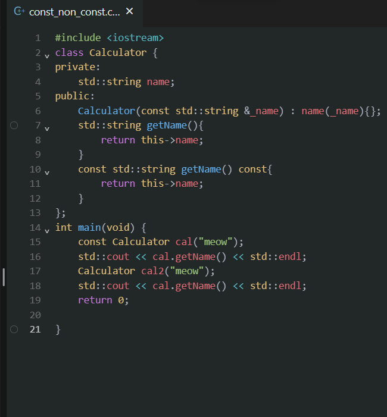

# const vs. non-const for member functions

>  const objects can only call const functions 

Let's have a look!

As you can see,the object is decorated by const,so it can not call the getName() member function.

But if we decorate the function using const after it,which means that it becomes a const member function.

Since then,it can not change the object's attribute,because it is a const member function.

Rember: Placing `const` after the function's parameter list indicates that the function is a `const` member function.This means that the function won't modify any non-`mutable` members of the class. It's a promise that the function won't change the state of the object it's called on.

So,what's the meaning of const before the function.

Placing `const` before the function's return type indicates that the returned value is a constant value. It means that the function returns a `const` value, and this value cannot be modified.

So,what is mutable ,just see the article in my blog...
