# Build the make environment on windows and Linux

# Intro Of Make
> Intro: When we write c++ programs,we always need to use commands such as `g++ xxx.cpp -g -std=c++17 -Wall -o xxx`,then we can compile our program and execute it.
> However,it is complicated,maybe waste mass of time.
> Then, make appears.

Since then,we can compile our program by execute `make` in our terminal,and then our program will be compile.

That's so cool! Isn't it?

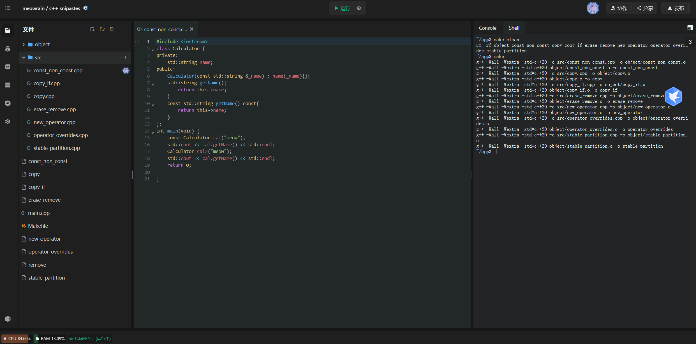

> When you use make,the result is just like the image upon.

# How to create a Make Environment on windows?
Just click the [URL](https://sourceforge.net/projects/mingw-w64/files/) here.
And you will enter in a new website

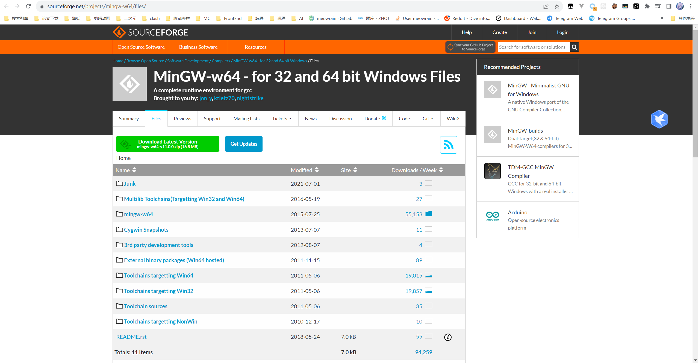


Then click where the arrow points to.
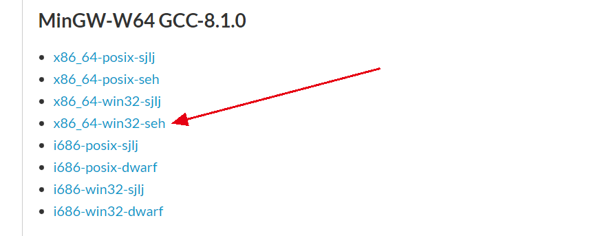

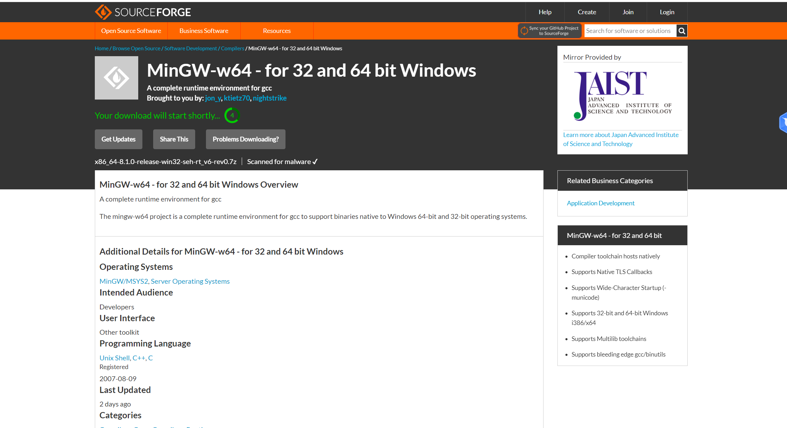


After downloading over,move it to another place,you can create a directory like `env` to store your programming environment.
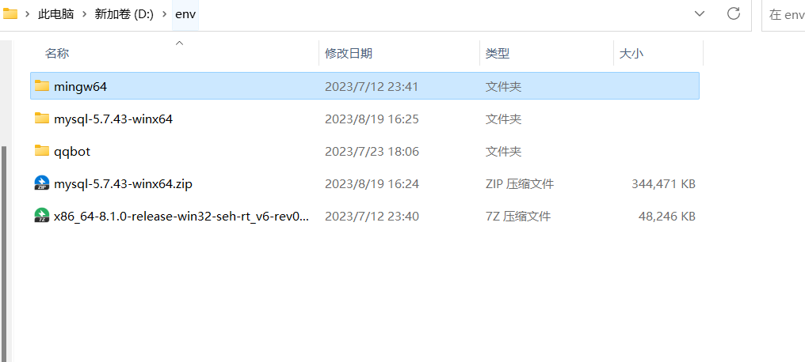

Then unzip it.Enter in the directory we unzip just now.
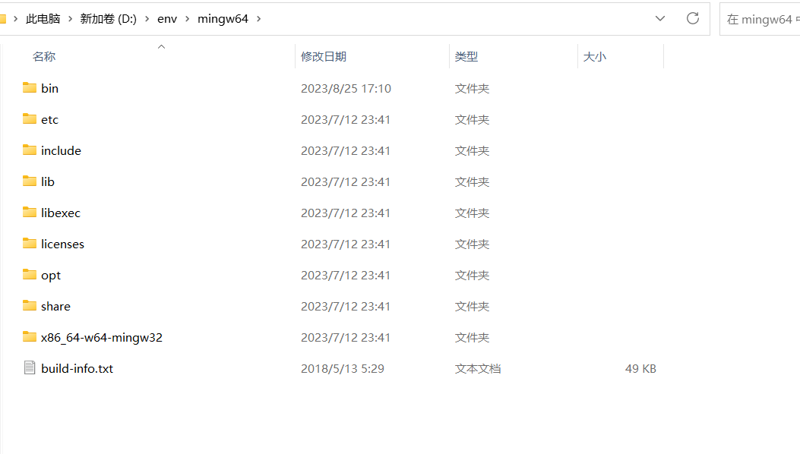

Then click bin directory.
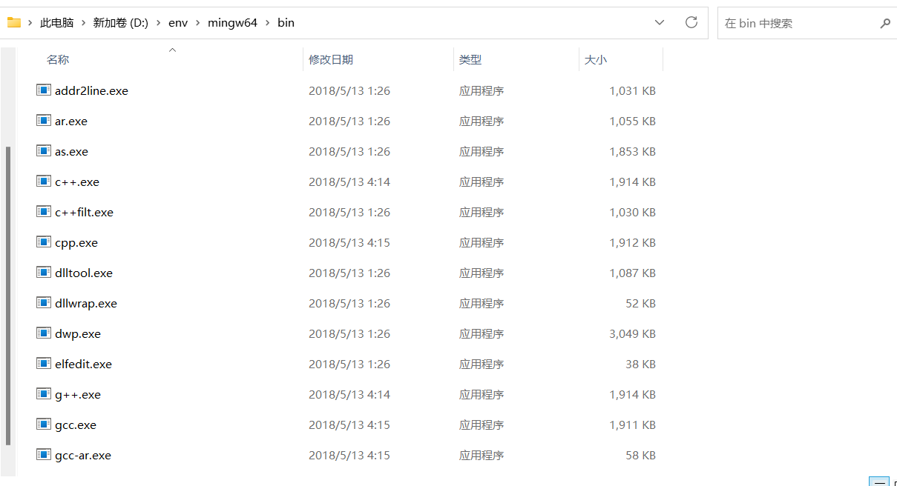

Copy the path of it
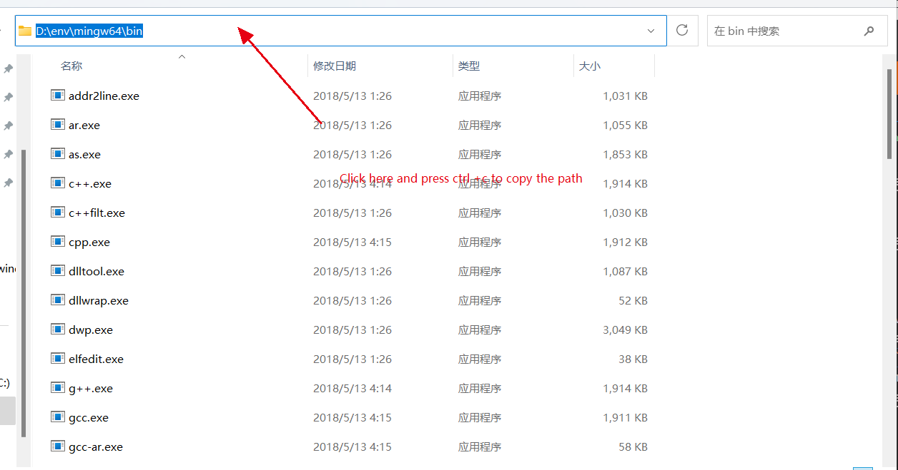

Now we can use windows shortcuts:`windows + q`,


Then search env


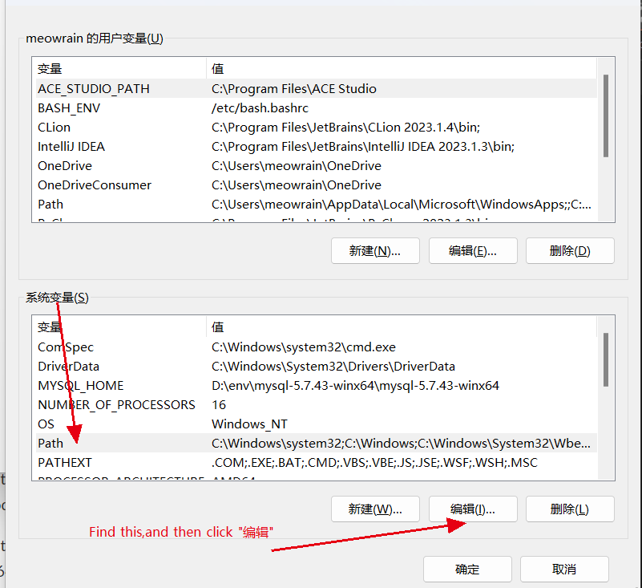

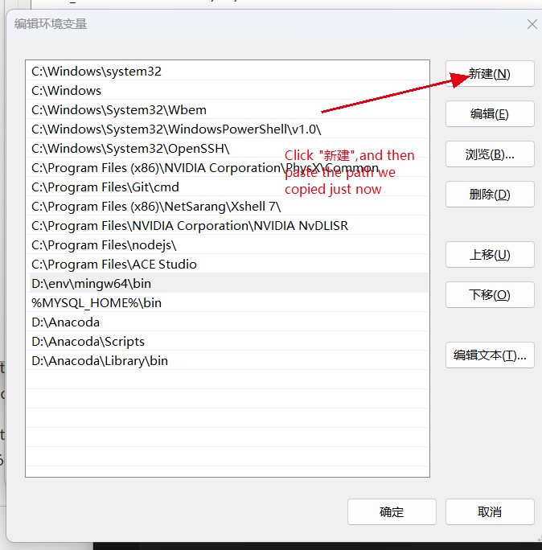

Then we click "确定"


Did it work?Let's see!

Open the terminal:

Input `gcc -v` and see whether you have the words like the images below
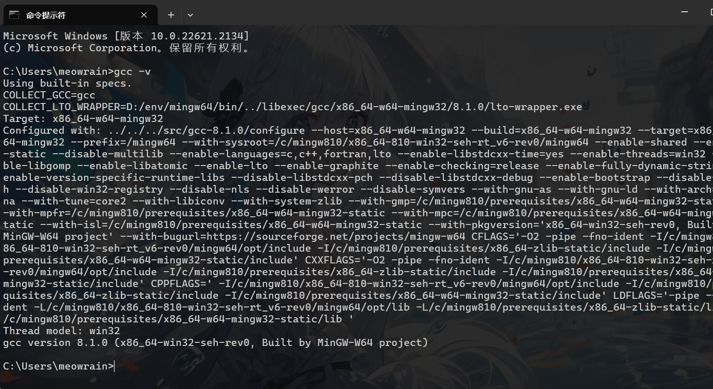


> 😊Congratulations! Now we have successfully create gcc&g++ system environment variables.

😉However,make command still not work.Why?
It's because in mingw-w64,make program is not called make,but mingw32-make.What we need to do is just change the name of it.Then make works!

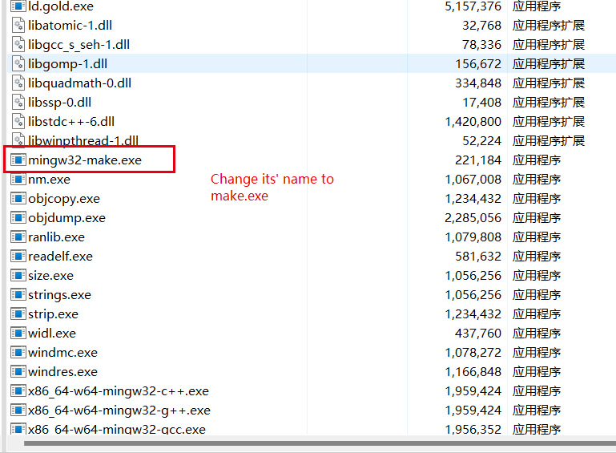


## How to create a Make Environment on Linux?

Use your package manager such as apt.

```sh
sudo apt-get install gcc g++ make
```

Then,then write your makefile,start your programming journey！

